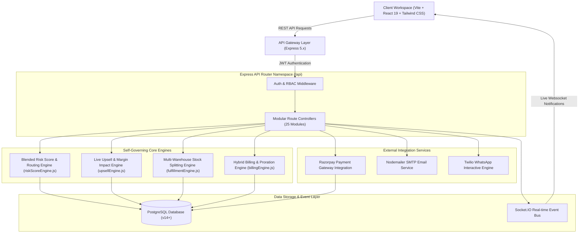
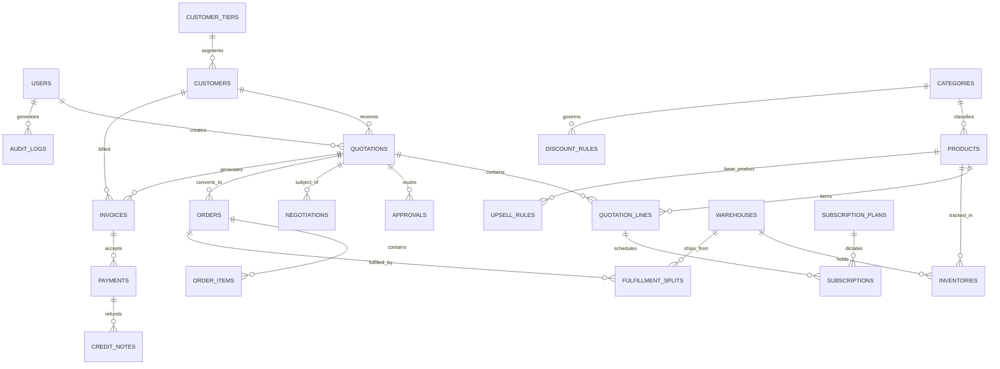
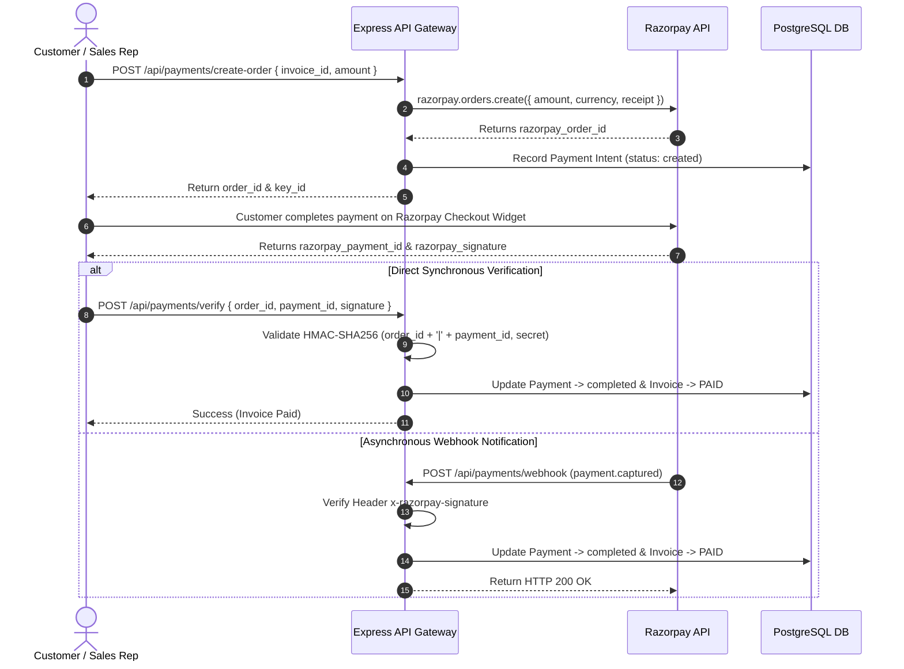

# DealFlow360 — System Architecture & Technical Specification

DealFlow360 is an intelligent, self-governing B2B Sales Operations Platform designed to streamline quotation governance, enforce multi-tiered discount discipline, automate approval chains, calculate live margin deltas, execute multi-warehouse fulfillment splitting, process hybrid billing schedules, and manage integrated payment gateways.

---

## 1. System Architecture Overview

DealFlow360 follows a decoupled, layered micro-architecture featuring a Client Presentation Layer, an Express 5 REST API Gateway, Core Business Logic Engines, a Payment Gateway Layer, a Real-Time Event Bus, and a PostgreSQL Data Persistence Layer.

---

## 2. Complete Entity-Relationship Model (ERD)

The database persistence layer is modeled around 24 relational entities across 7 core functional domains:

---

## 3. Core Business Logic Engines

DealFlow360 incorporates 4 specialized, self-governing business logic engines:

### 3.1 Blended Risk Score & Approval Routing Engine (`riskScoreEngine.js`)
Evaluates line-level and order-level discount excesses against customer tier ceilings and product category default limits.

- **Formula**:
  $$S_{\text{risk}} = \left( \sum w_i \cdot \text{Excess}_i \right) \times 10 + \max(0, \text{Disc}_{\text{order}} - \text{Ceiling}_{\text{tier}}) \times 5$$
  Where:
  $$w_i = \frac{\text{LineTotal}_i}{\text{Subtotal}}$$
  $$\text{Excess}_i = \max(0, \text{Disc}_i - \text{Ceiling}_{\text{cat}}, \text{Disc}_i - \text{Ceiling}_{\text{tier}})$$

- **Approval Routing Chains**:
  - $S_{\text{risk}} = 0$ & no violations: Status `approved` (Auto-Approved).
  - $0 < S_{\text{risk}} \le 15$: Requires `sales_manager` approval.
  - $S_{\text{risk}} > 15$: Dual approval chain (`sales_manager` $\rightarrow$ `finance_ops`).

---

### 3.2 Live Upsell & Margin Impact Engine (`upsellEngine.js`)
Evaluates cart co-purchase frequency rules and active product promotions to calculate real-time margin impact previews before items are added to a quote.

- **Formula**:
  $$\Delta \text{Margin}\% = \text{Margin}_{\text{new}}\% - \text{Margin}_{\text{current}}\%$$
  $$\text{RankScore} = \text{PromotedWeight} \cdot \text{CoPurchaseScore} \cdot \text{MarginFactor}$$

---

### 3.3 Multi-Warehouse Fulfillment & Backorder Engine (`fulfillmentEngine.js`)
Greedily allocates inventory across multiple depots sorted by shipping cost weight. If stock is insufficient at a single depot, it splits shipments automatically and computes backorders.

- **Greedy Allocation Strategy**:
  Sort warehouses $W = \{w_1, w_2, \dots, w_n\}$ where $\text{Weight}(w_1) \le \text{Weight}(w_2)$. Allocate $q_{\text{take}} = \min(q_{\text{remaining}}, \text{Stock}(w_i, p))$.

---

### 3.4 Hybrid Billing & Mid-Cycle Proration Engine (`billingEngine.js`)
Separates one-time hardware/service items from recurring SaaS subscriptions, generating 12-month billing schedules and computing exact mid-cycle proration adjustments.

- **Proration Formula**:
  $$\text{Adjustment}_{\text{net}} = \left( \frac{\text{Rate}_{\text{new}}}{D_{\text{cycle}}} \cdot D_{\text{remaining}} \right) - \left( \frac{\text{Rate}_{\text{orig}}}{D_{\text{cycle}}} \cdot D_{\text{remaining}} \right)$$

---

## 4. Payment Gateway Integration Architecture (Razorpay)

DealFlow360 integrates with Razorpay to provide secure end-to-end payment processing:

---

## 5. Security & Role-Based Access Control (RBAC) Matrix

DealFlow360 implements strict HTTP Bearer JWT verification (`authenticateJWT`) and role-based permissions (`authorizeRoles`).

| Domain | Endpoint / API | Admin | Sales Manager | Finance Ops | Sales Rep | Customer |
| :--- | :--- | :---: | :---: | :---: | :---: | :---: |
| **Auth** | `/auth/login`, `/auth/me`, `/logout` | Yes | Yes | Yes | Yes | Yes |
| **Users** | `GET /users`, `POST /users`, `DELETE` | Yes | View Only | View Only | No | No |
| **Customers** | `GET /customers`, `POST /customers` | Yes | Yes | Yes | Yes | No |
| **Tiers** | `GET /customer-tiers`, `POST`, `DELETE` | Yes | View Only | Yes | View Only | View Only |
| **Catalog** | `GET /products`, `GET /categories` | Yes | Yes | Yes | Yes | Yes |
| **Quotations**| `GET /quotations`, `POST /quotations` | Yes | Yes | Yes | Yes | View Only |
| **Approvals** | `GET /approvals`, `POST /approve` | Yes | Yes | Yes | No | No |
| **Portal** | `GET /negotiations`, `POST /counter` | Yes | Yes | Yes | Yes | Yes |
| **Payments** | `POST /payments/create-order` | Yes | Yes | Yes | Yes | Yes |
| **Payments** | `POST /payments/verify` | Yes | Yes | Yes | Yes | Yes |
| **Payments** | `GET /payments` (List All) | Yes | Yes | Yes | No | No |
| **Payments** | `POST /payments/:id/refund` | Yes | No | Yes | No | No |
| **Audit** | `GET /audit`, `GET /reports/sales` | Yes | Yes | Yes | No | No |

---

## 6. Future Expansion Roadmap

1. **Enterprise ERP Sync Adapters**: Webhook adapters for real-time general ledger posting into SAP, Oracle NetSuite, and QuickBooks.
2. **Predictive AI Discount Optimization**: Machine learning models predicting deal closure probability at various discount percentages.
3. **Multi-Currency Real-Time Exchange Rates**: Dynamic FX table integration with automated currency hedging adjustments.
